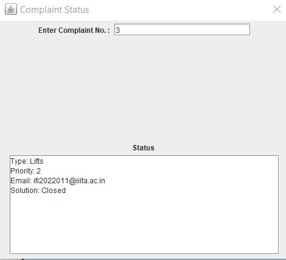
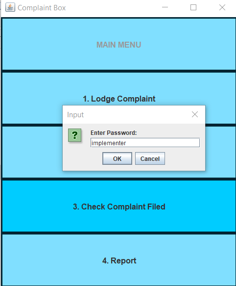
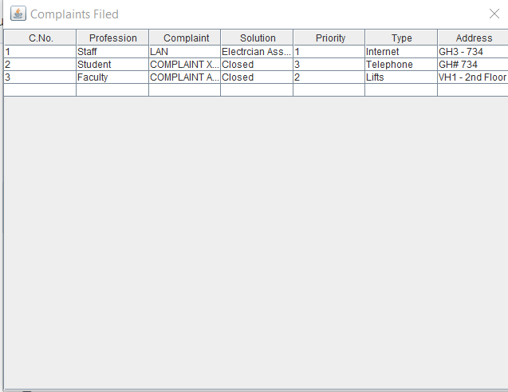

# College Complaint Management System

## Overview
The College Complaint Management System is a Java-based desktop application designed to streamline the process of registering, tracking, and resolving complaints within a college environment. The system provides a user-friendly interface for students, faculty, and staff to communicate their concerns efficiently. The project aims to enhance communication, transparency, and efficiency in addressing various issues within the college.

## Features
- **Complaint Registration:** Students, faculty, and staff can register complaints, providing relevant details about the nature of the concern, their email, and address.
- **Complaint Tracking:** Complainants can track the status and progress of their registered complaints using the complaint number.
- **Complaint Resolution:** Administrators can resolve and close complaints, with solutions recorded in the system.
- **Complaint Reports:** View a table of all filed complaints for administrative review.

## Project Structure
- **CGClient.java:** Main class to launch the application. Instantiates the main GUI.
- **ComplaintGUI.java:** Manages the main graphical user interface, including the main menu and navigation to complaint registration, status checking, and reporting.
- **compFile.java:** Handles the storage, retrieval, and management of complaint data (serialization to a file).
- **complaint.java:** Represents a complaint with attributes such as complaint number, department, description, solution, priority, type, email, and address.
- **compRegister.java:** Provides a GUI for registering new complaints.
- **compStatus.java:** Displays the status and details of a specific complaint.
- **compReport.java:** Generates a report displaying all filed complaints in a table format.

## Getting Started
### Prerequisites
- Java Development Kit (JDK) 8 or higher

### How to Run
1. **Compile all Java files:**
   ```
   javac *.java
   ```
2. **Run the main class:**
   ```
   java CGClient
   ```

The application window will open, allowing you to register complaints, check their status, and view reports.

## Notes
- Complaint data is stored in a temporary file (`comps.txt`) in your system's temp directory.
- The admin section (for checking all complaints) is password-protected. The default password is `implementer` (see `ComplaintGUI.java`).

## Screenshots
Below are example screenshots demonstrating the application's main features:

- **Main Menu:**
  
  *Central navigation for all system features.*

- **Complaint Registration Form:**
  
  *User input form for registering new complaints.*

- **Complaint Status Window:**
  
  *Real-time tracking of complaint progress.*

- **Admin Report View:**
  
  *Tabular display of all filed complaints for administrative review.*

- **Admin Login:**
  
  *Password-protected admin access for complaint management.*

- **Complaint Record:**
  
  


---

